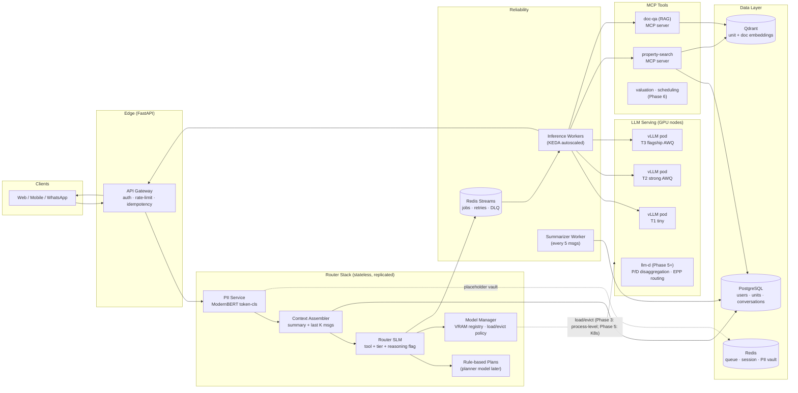
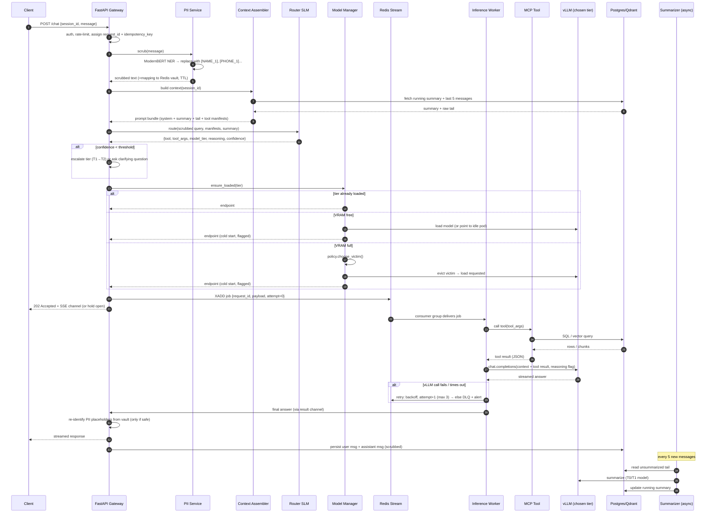
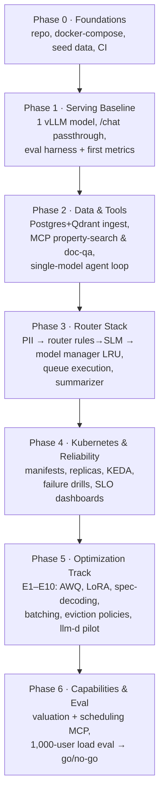

# Real Estate AI Agent — System Design & Build Workflow

**Version:** 1.0 · **Date:** 2026-07-17 · **Audience:** engineering team
**Purpose:** learning-driven build (senior → team-lead scope) that ships to a **1,000-user evaluation** and then to production if successful.

---

## 0. Decisions Locked (from kickoff)

| Decision | Choice | Consequence |
|---|---|---|
| Hardware path | Start: 1× L40S (48 GB) → then small server (2–4 GPUs) → maybe large server | Model tiers must fit 48 GB on day one; multi-GPU support comes in Phase 4–5 |
| Scale target | PoC that must survive ~1,000 eval users | Design for production patterns, but build them in phases (don't gold-plate day one) |
| v1 capabilities | **Document Q&A (RAG) + Property search (SQL + vector)** first; valuation/analytics + scheduling/lead capture in phase 2 | MCP tool set v1 = 2 tools |
| Cloud models | **Skipped for v1**; keep a `cloud` target in the router registry interface only | Zero PII-leak risk to third parties; easy A/B vs OpenAI/Anthropic later |
| Deliverable | This document (Markdown + Mermaid) | Diagrams render in GitHub/GitLab/VS Code/Notion |

---

## 1. Goals, Non-Goals, SLOs

### 1.1 Goals
1. A working real-estate agent that answers over **your** inventory (Postgres) and **your** documents (Qdrant) via MCP tools.
2. A **router stack** in front of K self-hosted models: PII scrubbing → model/tool selection → VRAM-aware model loading/eviction.
3. An **LLM serving experiment platform** on vLLM: model variants (base / AWQ / LoRA / smaller), serving knobs (continuous batching, PagedAttention, prefix caching, chunked prefill, speculative decoding), later llm-d.
4. Production-grade reliability: queue-based execution with retries, K8s replicas, observability, background summarization.

### 1.2 Non-goals (v1)
- No cloud model traffic (interface stub only).
- No multi-step autonomous planner (rule-based plans only — see §7.4).
- No llm-d on day one (graduates when concurrency justifies it — see §6.6).

### 1.3 SLOs for the 1,000-user eval (tune after baseline)
| Metric | Target |
|---|---|
| p95 TTFT — tiny/strong tier | < 1.5 s |
| p95 TTFT — flagship tier | < 3.0 s |
| p95 end-to-end (tool call included) | < 8 s |
| PII recall (must-scrub entities) | ≥ 98% |
| Router tool-selection accuracy | ≥ 90% (after distillation) |
| Request success rate (incl. retries) | ≥ 99.5% |
| Cold-start (model load) rate | < 5% of requests |

---

## 2. Model Tiers & Hardware Path

The router chooses among **K = 4 tiers** (T4 is a stub). Concrete models are examples — swap families freely, keep the tier *roles* stable.

| Tier | Role | Example (2026) | VRAM (approx.) | Fits L40S 48 GB? |
|---|---|---|---|---|
| **T0** | PII NER + Router SLM + Summarizer | ModernBERT-base (NER), Qwen3-1.7B (router/summarizer) | < 4 GB (or CPU) | ✅ always resident |
| **T1** | Tiny — chit-chat, simple lookups, tool-arg formatting | Qwen3-4B / Llama-3.2-3B | ~8 GB (BF16) | ✅ |
| **T2** | Strong — default workhorse for RAG + tool use | Qwen3-14B / Qwen2.5-14B AWQ-INT4 | ~10–16 GB (AWQ) | ✅ |
| **T3** | Flagship — hard reasoning, valuation synthesis; **reasoning on/off** | Qwen3-32B (hybrid thinking toggle) | ~20 GB AWQ / ~65 GB BF16 | ✅ AWQ only (BF16 needs small server) |
| **T4** | Cloud (OpenAI/Anthropic) — **disabled stub** | — | — | interface only |

**Rules of thumb**
- On the L40S: keep **T0 + T2 always loaded** (they cover ~80% of traffic), T1 is cheap enough to keep too, and **T3-AWQ is the swap candidate** — this is exactly where your eviction-policy experiments live.
- On the small server (2–4 GPUs): T3 can be BF16 with `--tensor-parallel-size 2`; eviction matters less, batching/spec-decoding experiments matter more.
- Reasoning on/off: expose it as a router output flag (`reasoning: true|false`), implemented per model (e.g., Qwen3 `/think` vs `/no_think` prompting or `chat_template_kwargs`).

---

## 3. High-Level Architecture



### Component responsibilities (one line each)
- **API Gateway (FastAPI):** auth, rate limiting, request ID + idempotency key, enqueue job, stream response (SSE).
- **PII Service:** ModernBERT token-classification; replaces entities with placeholders; stores mapping in a per-session **vault** (Redis, TTL); only scrubbed text is ever logged or sent to models.
- **Context Assembler:** builds prompt = system + running summary + last 5 raw messages (+ tool manifests).
- **Router SLM:** one small model, structured JSON out: which **tool**, which **model tier**, **reasoning on/off**.
- **Model Manager:** knows what is loaded, VRAM free, last-used, in-flight count; applies pluggable **eviction policy** (LRU first).
- **Queue + Workers:** decouple accept-from-execute; retries with backoff; dead-letter queue; idempotent execution.
- **vLLM pods:** one Deployment per resident tier; OpenAI-compatible endpoints.
- **MCP servers:** one per capability; the agent loop calls them by manifest name.

---

## 4. End-to-End Request Lifecycle (query → response)



**Key properties of this flow**
- **Idempotency end-to-end:** `idempotency_key = hash(session_id, message, client_ts)`; the worker checks a dedup set in Redis before executing, so a retried delivery never double-books a viewing or double-writes a message.
- **PII never reaches a model or a log raw.** Re-identification happens only in the gateway, only for placeholders the model actually echoed, and only from the server-side vault.
- **Queue absorbs failure:** gateway returns fast; worker retries vLLM/tool calls with exponential backoff (`1s, 4s, 16s`), then dead-letters with full context for replay.
- **Cold starts are measured, not hidden:** every load/evict is logged with cause, so eviction-policy experiments have clean data.

---

## 5. FastAPI Surface (contract first)

```
POST   /v1/chat                    # main entry; SSE streaming
GET    /v1/chat/{request_id}       # poll fallback for non-SSE clients
POST   /v1/feedback                # thumbs up/down + tag → eval store
GET    /v1/sessions/{id}/history   # scrubbed history + summary
POST   /admin/models/load          # manual model ops (experiments)
POST   /admin/models/evict
GET    /admin/models/status        # loaded set, VRAM, in-flight
GET    /admin/queue/stats          # stream depth, DLQ size, retry rate
GET    /metrics                    # Prometheus
```

Build these routes against **stub implementations first** (PII=pass-through, router=rules, model=single vLLM). The system grows by replacing stubs, never by rewriting the contract.

---

## 6. LLM Serving Layer — vLLM Experiments (the "team-lead" track)

This is your experimentation core. Rule #1: **one variable at a time, fixed workload, recorded result.** Rule #2: every experiment ends with a keep/kill decision written into the results log.

### 6.1 Baseline server config (per tier)

```bash
vllm serve Qwen/Qwen3-14B \
  --quantization awq \
  --max-model-len 16384 \
  --gpu-memory-utilization 0.90 \
  --max-num-seqs 64 \
  --enable-prefix-caching \
  --enable-log-requests --disable-log-stats=false
```

vLLM already gives you **PagedAttention, continuous batching, and chunked prefill** out of the box — your job is to *tune and prove*, not to enable. [^5^]

### 6.2 Experiment matrix

| # | Axis | Variants | Primary metric | Expected learning |
|---|---|---|---|---|
| E1 | **Model size per task** | T1 4B vs T2 14B vs T3 32B on the golden set | quality (LLM-judge + task accuracy) vs tok/s | which tier *should* own which intent |
| E2 | **Quantization** | T2 BF16 vs AWQ-INT4 (vs FP8 on L40S) | quality delta, tok/s, VRAM | AWQ cost in quality on real-estate RAG |
| E3 | **LoRA fine-tune** | T2 base vs T2 + LoRA (intent/tool-format/real-estate style) | tool-call validity %, judge score | does a small adapter beat a bigger model |
| E4 | **Multi-LoRA serving** | one base + N adapters (`--enable-lora`) vs N separate servers | VRAM saved, adapter-switch latency | vLLM serves many LoRAs off one base — huge for your "K models" idea [^5^] |
| E5 | **Batching knobs** | `--max-num-seqs` 16/64/256; `--max-num-batched-tokens` | throughput vs p95 TTFT trade-off curve | your batching sweet spot per tier |
| E6 | **Prefix caching** | on/off with real chat traffic (shared system prompt + tool manifests) | TTFT, cache hit rate | should be a big win — your prompts share long prefixes |
| E7 | **Speculative decoding** | none vs n-gram vs EAGLE (if a head exists for your family) | TPOT, acceptance rate | great at low concurrency; **diminishes at batch >16** — measure, don't assume [^1^][^4^] |
| E8 | **KV cache & length** | `--max-model-len`, KV dtype (FP8 KV), block size | VRAM per concurrent session | how many concurrent chats one L40S really holds |
| E9 | **Eviction policy** | LRU vs LFU vs cost-aware (load-time × size) vs tier-pinned | cold-start rate, added p95 latency | your policy experiment (§7.3) |
| E10 | **Router quality** | rules → distilled SLM → distilled + LoRA | routing accuracy, escalation rate | distillation from T3-with-reasoning labels |

### 6.3 Experiment harness (build once, use forever)

1. **Golden workload:** 300–500 real real-estate prompts covering: property search (filter-heavy), doc Q&A, chit-chat, PII-heavy messages, adversarial/off-topic, multi-turn. Versioned in git.
2. **Load generator:** k6 or Locust driving the OpenAI-compatible endpoint at fixed concurrency levels (1, 4, 16, 64).
3. **Metrics capture:** vLLM `/metrics` → Prometheus; per-run snapshot written to `experiments/runs/<date>_<name>.yaml` with: config diff, TTFT p50/p95/p99, TPOT, throughput (tok/s), goodput at SLO, VRAM peak, quality score on golden set.
4. **Quality judge:** T3-with-reasoning (or later a cloud model) grades answers 1–5 on groundedness + usefulness; plus hard checks (tool-call JSON validity, SQL correctness on search tasks).
5. **Results log template:**

```yaml
experiment: E2-awq-vs-bf16
date: 2026-07-20
hardware: 1xL40S
config_diff: {quantization: awq}
workload: golden-v1 @ concurrency=16
results: {ttft_p95_ms: 1180, tpot_ms: 31, tok_s: 1450, vram_gb: 15.8, quality: 4.31}
baseline: {ttft_p95_ms: 1050, tpot_ms: 22, tok_s: 980,  vram_gb: 29.5, quality: 4.44}
decision: KEEP  # -3% quality, -46% VRAM → T2 default becomes AWQ
owner: <name>
```

### 6.4 What to expect (so you can sanity-check your numbers)

- **AWQ INT4** typically costs little quality on 7B–14B instruct models and roughly halves-to-quarters VRAM — it is what makes a 32B flagship fit on one L40S.
- **Speculative decoding** shines at batch 1–8 (often 1.4–3× TPOT with EAGLE; n-gram ~1.2–1.5× and free) and fades toward 1.0× once continuous batching saturates compute — so it helps your *demo feel* and low-traffic hours, not your peak throughput. [^1^][^7^]
- **Prefix caching** is your quiet superpower: system prompt + tool manifests + RAG boilerplate are identical across requests.

### 6.5 llm-d — when and why

llm-d (now a CNCF Sandbox project, backed by Red Hat/IBM/Google/NVIDIA) adds three things on top of vLLM-on-K8s: **prefill/decode disaggregation** into separately-scaled pod pools, **hierarchical KV-cache offload** (GPU→CPU→NVMe), and **prefix-cache-aware routing** via the Gateway API Inference Extension (EPP). [^2^][^3^]

**Adoption criteria — all true before piloting (Phase 5+):**
- Sustained concurrency **> ~30–50** requests (below that, KV-transfer overhead can outweigh the win), and [^3^]
- You run ≥ 2 GPU nodes, and
- TTFT at peak violates SLO while GPUs show decode/prefill interference.

Until then, monolithic vLLM pods + your Model Manager are simpler and better. When you do pilot: one model (T2) behind llm-d, A/B against the monolith on the same workload.

---

## 7. Router Stack (your steps 1–5, made concrete)

### 7.1 PII Service — ModernBERT

- **Model:** `ModernBERT-base` fine-tuned for token classification (BIO tags) on a PII dataset (e.g. `ai4privacy/pii-masking-*`) **plus your own synthetic real-estate set** — Egyptian/Gulf names, phone formats, national IDs, compound addresses are where public datasets are weak. Generate 5–10k synthetic chats with your flagship model, label them, add to training.
- **Entities v1:** PERSON, PHONE, EMAIL, NATIONAL_ID, ADDRESS, BANK/IBAN. (Property *listing* addresses are business data — decide explicitly whether to scrub them; recommendation: scrub only **personal** addresses.)
- **Serving:** ONNX/quantized on CPU is fine (< 10 ms); keep it out of the GPU budget entirely.
- **Replacement:** `[NAME_1]`, `[PHONE_2]`… mapping → Redis key `pii:{session_id}` with TTL = session TTL. **Only scrubbed text** is logged, stored in conversation history, or sent to any model.
- **Re-identification:** gateway substitutes placeholders back *only* if the model echoed them and the vault entry exists — otherwise the placeholder is dropped.
- **Metrics:** per-entity precision/recall on a held-out set; recall ≥ 98% is a **release gate** (a PII miss is worse than a bad answer).

### 7.2 Router SLM — tool + tier selection

**Input:** scrubbed query + running summary + compact tool manifests (name, 1-line description, arg schema) + tier descriptions.
**Output (strict JSON, enforce with vLLM structured output / xgrammar):**

```json
{
  "intent": "property_search",
  "tool": "property_search",
  "tool_args": {"city": "New Cairo", "type": "villa", "max_price": 15000000, "bedrooms": 4},
  "model_tier": "T2",
  "reasoning": false,
  "confidence": 0.87
}
```

**Build it in three steps (each shippable):**
1. **Rules baseline** (day 1): keyword/regex + embeddings-similarity to intent examples. Gets you running and gives you the "before" number.
2. **Distilled SLM:** generate 10–30k labeled routing decisions with **T3 + reasoning on** (teacher), filter by teacher self-consistency, LoRA-fine-tune Qwen3-1.7B on them. Serve it as a **LoRA adapter on the T1/T2 base** (multi-LoRA, §6.2 E4) so it costs no extra GPU.
3. **Online improvement:** log every routing decision + downstream success (tool error? user re-ask? negative feedback?) → weekly retraining set. Routing accuracy and escalation rate are standing dashboard tiles.

**Escalation policy:** `confidence < 0.6` → bump one tier up and re-ask the model to self-check; repeated low confidence on an intent → that intent goes into the next distillation batch.

### 7.3 Model Manager — load/evict with pluggable policies

**Phase 3 (single GPU box):** the manager runs inside the router service and controls vLLM **processes** on the box (start/stop with pinned CUDA_VISIBLE_DEVICES, or use a second GPU slot).

```python
class EvictionPolicy(Protocol):
    def choose_victim(self, loaded: list[ModelEntry], needed_gb: float) -> str: ...

@dataclass
class ModelEntry:
    tier: str
    vram_gb: float
    loaded_at: datetime
    last_used: datetime
    in_flight: int          # never evict while > 0
    load_time_s: float      # measured, per model
    pinned: bool            # T0/T2 pinned in early phases
```

**Policies to compare (E9):**
- `LRUPolicy` — baseline you asked for: evict least-recently-used non-pinned model.
- `LFUPolicy` — evict lowest request-count in trailing window.
- `CostAwarePolicy` — evict the model with the lowest `requests_per_gb × (1 / load_time_s)` (a 32B that takes 3 min to reload is "expensive" to evict).
- `WarmPredictPolicy` (stretch) — pre-load the tier the router *trend* suggests (e.g., valuation questions spike in the evening).

**Fair comparison:** replay the same recorded traffic against a simulator first, then A/B live. Metrics: cold-start rate, p95 latency added by loads, evictions/hour, "evict-then-reload-within-5-min" thrash count.

**Phase 5 (K8s):** the same policy interface moves up a level — victims/victors become **vLLM Deployments scaled 0↔1** (models on a shared NVMe PVC + `--load-format` fast load, or llm-d scale-to-zero later). The policy code doesn't change; the actuator does.

### 7.4 Planner — deliberately deferred

Your step 4 ("planning model first, or just answer?") — **v1: no planner model.** Instead, rule-based plan templates keyed by router intent:

- `property_search` → tool → answer (1 step)
- `doc_qa` → retrieve → answer with citations (1 step)
- `valuation` (Phase 6) → search comps → analytics → synthesize (fixed 3-step template, not free planning)

A free-form planner LLM adds latency, cost, and failure modes you can't yet measure. Graduate to it only when ≥ 3 intents need **dynamic** step ordering — by then you'll have traces showing exactly what it must do. That's a team-lead call: build the thing the data demands, not the impressive thing.

### 7.5 Summarization worker — rolling memory

- Trigger: after every **5 new messages** in a session (a DB trigger on message count, or the worker just polls `WHERE messages_since_summary >= 5`).
- Job: `new_summary = summarize(old_summary + last 5 exchanges)` using **T0/T1** (cheap; this is a background task — quality bar is "no facts lost", test with a small QA-over-summary eval).
- Context assembly always = `system + running_summary + last 5 raw messages`. Token cost per request stays **flat** as conversations grow — this plus prefix caching is why your long chats stay cheap.
- Store summaries versioned in Postgres (`summaries.session_id, version, text, created_at`) so you can roll back and A/B summarizer prompts.

---

## 8. Queue & Reliability — Redis now, Kafka later (deliberately)

**Recommendation: Redis Streams first.** At 1,000 eval users you're at single-digit average QPS; Streams gives you consumer groups, pending-ack tracking, and replay with a fraction of Kafka's operational weight — and you already run Redis for cache/vault. Kafka becomes the experiment when you need multi-day retention, many independent consumers (analytics + training-data pipelines), or > ~10⁵ msgs/day sustained. Keep the producer/consumer behind a `JobQueue` interface so the swap is an experiment, not a rewrite.

**Envelope & retry semantics:**

```json
{
  "request_id": "01J...ULID",
  "idempotency_key": "sha256(session_id|message|client_ts)",
  "payload": {"context_ref": "pg://messages/...", "tier": "T2", "tool": "property_search", "tool_args": {...}},
  "attempt": 0,
  "trace_id": "otel-trace-id"
}
```

- **Delivery:** consumer group `inference-workers`; on failure → `attempt+1`, re-enqueue with backoff 1s/4s/16s; after 3 → `dlq:inference` stream + alert. Crashed workers' pending entries are reclaimed with `XAUTOCLAIM` (idle > 30 s).
- **Idempotent execution:** worker `SET NX` on `idem:{key}` before side effects; duplicates short-circuit to the stored result.
- **Backpressure:** gateway checks stream length; over threshold → shed to a lower tier and/or return "busy, retry in N s" honestly.
- **What K8s gives you on top:** worker pods that crash are rescheduled (§10) — the queue guarantees the *job* isn't lost, K8s guarantees the *worker* comes back. Two different failure domains, both covered.

---

## 9. Data Layer

### 9.1 PostgreSQL (system of record)

```sql
users(id, phone_hash, name_vault_ref, created_at, ...)
units(id, type, city, district, price, bedrooms, area_m2, amenities jsonb,
      description, embedding_id, status, ...)            -- the villas/houses inventory
conversations(id, user_id, started_at, last_active_at, channel)
messages(id, conversation_id, role, content_scrubbed, tier, tool, latency_ms,
         feedback, created_at)
summaries(id, conversation_id, version, text, covers_until_msg_id, created_at)
tool_calls(id, request_id, tool, args, result_ref, status, latency_ms)
routing_log(id, request_id, intent, tier, confidence, escalated, model_version)
experiments(...)                                          -- §6.3 results, queryable
```

Rules: **never store raw PII** in `messages` (scrubbed only; mapping lives in the Redis vault with TTL); every model/tool decision lands in `routing_log` — this table is your distillation training set later.

### 9.2 Qdrant (localhost → K8s service)

- `units_embeddings` — vector per unit built from `description + structured fields` rendered as text; payload = the unit's filterable fields (city, price, type, bedrooms) so **one Qdrant query does hybrid filter+vector**.
- `documents_chunks` — contracts/brochures/legal, chunked 300–500 tokens with 15% overlap, payload = {doc_id, section, page}.
- Embedding model: a multilingual-e5/bge-m3-class model served as a tiny sidecar service (or CPU); version the collection name with the embedding model (`units_embeddings_v1`) so re-embedding is a blue/green swap.

### 9.3 Redis (three logical uses, one instance is fine for eval)

`stream:jobs` + `stream:dlq` (queue) · `sess:{id}` hot context cache · `pii:{session_id}` vault (TTL) · `idem:{key}` dedup · `model_registry` (loaded set, VRAM, heartbeats).

---

## 10. MCP Tools (one server per capability)

| MCP server | Phase | Backing | Notes |
|---|---|---|---|
| `property-search` | 2 | Postgres + Qdrant | tools: `search_units(filters, query, k)`, `get_unit(id)`, `list_cities()`; SQL for hard filters, vector for "near the park, family-friendly" semantics — merge in the tool, not the prompt |
| `doc-qa` | 2 | Qdrant (+ Postgres docs table) | `search_docs(query, doc_type?, k)` → chunks with citations; agent must cite `doc_id/page` |
| `valuation` | 6 | Postgres comps + analytics | `estimate_price(unit_id|specs)`, `market_trend(city, months)` |
| `scheduling` | 6 | Postgres + calendar/CRM API | `check_availability(unit_id, window)`, `book_viewing(...)` (idempotent!), `create_lead(...)` |

Each MCP server is its own container with its own FastAPI health endpoint, manifests served at `/.well-known/mcp` — the router reads manifests at startup, so **adding a tool = deploying a container, not touching the router.**

### 10.1 K8s layout (Phase 4)

```
namespace: realestate-ai
├── deploy/api-gateway          ×3  (HPA: CPU)            # FastAPI
├── deploy/router-stack         ×2  (HPA: CPU)            # PII+router+manager, stateless
├── deploy/inference-worker     ×N  (KEDA: stream:jobs length)
├── deploy/summarizer-worker    ×1
├── deploy/mcp-property-search  ×2
├── deploy/mcp-doc-qa           ×2
├── deploy/vllm-t2              ×1  (GPU node, 1×L40S)    # resident
├── deploy/vllm-t3              ×0..1 (GPU node)          # policy-driven scale
├── statefulset/postgres (+PVC, backups)
├── statefulset/qdrant   (+PVC)
└── statefulset/redis    (+PVC, AOF)
```

- **GPU:** NVIDIA GPU Operator, node label `gpu=L40S`, vLLM pods request `nvidia.com/gpu: 1`; models on a shared fast PVC (or node-local NVMe hostPath for the eval box) to make reloads seconds-not-minutes.
- **Self-healing:** readiness probes hit `/health` on vLLM (fails while loading → no traffic to a cold pod); liveness restarts hung processes; PDBs keep one gateway/worker alive during rollouts. Any pod dying is a non-event — **that** is the property you demo to the team.
- **Autoscaling:** HPA for stateless CPU services; **KEDA** scaled-object on Redis stream length for inference workers; (later) llm-d InferencePool autoscaling for GPU pools.
- **Config/flags:** every vLLM flag from §6 lives in Helm values — an experiment = a PR changing values + a canary deploy.

---

## 11. Build Order — what to build, then what (the workflow to share)

Each phase has **exit criteria**. Don't start the next phase until they're green — this discipline is the difference between an experiment platform and a pile of demos.



### Phase 0 — Foundations *(~1 week)*
- Monorepo: `services/{gateway,router,worker,...}`, `mcp/`, `deploy/`, `experiments/`, `eval/`.
- `docker-compose.yml`: Postgres, Qdrant, Redis (+ stub vLLM later). Seed: 500–2,000 synthetic units, 20–50 sample documents.
- CI: lint + unit tests + build images. Observability skeleton: Prometheus, Grafana, OTel collector.
- **Exit:** `docker compose up` → health checks green; seeded data browsable via psql/Qdrant UI.

### Phase 1 — Serving baseline *(~1 week)*
- vLLM serving **one T2 model** on the L40S; gateway `/v1/chat` = pass-through (no router, no queue, no tools).
- Golden-set v1 (100 prompts to start) + k6 script + Prometheus scrape of vLLM.
- **Exit:** baseline report exists — TTFT/TPOT/throughput at concurrency 1/4/16/64 on real prompts. *This number anchors every future claim.*

### Phase 2 — Data & tools *(~2 weeks)*
- Postgres schema + ingest real inventory; Qdrant collections + embedding sidecar; document chunking pipeline.
- MCP `property-search` and `doc-qa`; single-model **agent loop** in the worker (model ↔ tool ≤ 3 rounds, citations required for doc-qa).
- **Exit:** user can ask "4-bed villa in New Cairo under 15M" and "what does the payment plan in this brochure say?" — answered from real data with citations; tool-call JSON validity ≥ 98%.

### Phase 3 — Router stack *(~2–3 weeks)*
- PII service (fine-tune ModernBERT; release gate recall ≥ 98%); Redis vault; gateway re-identification.
- Router: rules baseline → distill from T3 → SLM with structured output; `routing_log` from day one.
- Model Manager: T1+T2 resident, T3 on-demand, **LRU eviction first**; cold-start metrics wired.
- Redis Streams + workers + retries + DLQ + idempotency; summarizer worker (every 5 msgs).
- **Exit:** full §4 lifecycle runs end-to-end; kill -9 a worker mid-request → request still completes; conversation of 20 turns shows flat prompt-token growth.

### Phase 4 — Kubernetes & reliability *(~2 weeks)*
- Manifests/Helm for everything; GPU Operator; KEDA on stream length; HPA on gateway/router; PDBs; backups for Postgres/Qdrant.
- **Failure drills:** delete vLLM pod, delete worker pod, fill the queue, corrupt a DLQ message — each has a runbook and a measured recovery time.
- **Exit:** SLO dashboard live; all drills pass; deploy = one PR merge.

### Phase 5 — Optimization track *(ongoing, parallel)*
- Run **E1–E10** (§6.2) in order of leverage: E2 (AWQ) → E5/E6 (batching+prefix) → E1 (tier sizing) → E3/E4 (LoRA + multi-LoRA) → E7 (spec decoding) → E9 (eviction policies) → E10 (router distillation v2).
- llm-d pilot **only when §6.5 criteria are met**; A/B against monolith.
- **Exit (per experiment):** results log entry with a keep/kill decision. No orphan experiments.

### Phase 6 — Capabilities & 1,000-user eval *(~2–3 weeks)*
- MCP `valuation` + `scheduling` (idempotent booking!); rule-based 3-step plan template for valuation.
- Load test to 1,000 users (Locust scenario mix: 60% search, 25% doc-qa, 10% chit-chat, 5% PII-heavy); fix what breaks; re-run.
- Optional: enable T4 cloud stub for **offline benchmarking only** (quality anchor for your self-hosted tiers).
- **Exit:** go/no-go report — SLO table from §1.3 all green at target load, cost/user/month computed, known-limitations list.

---

## 12. Suggested Team Split (3–5 engineers)

| Stream | Owns | Phases |
|---|---|---|
| **Serving & Infra** | vLLM configs, GPU nodes, K8s, KEDA, llm-d, observability | 0, 1, 4, 5 |
| **Router & ML** | PII model, router distillation, model manager/policies, summarizer, eval judges | 3, 5 |
| **Data & Tools** | Postgres/Qdrant ingest, embeddings, MCP servers, agent loop | 2, 6 |
| **API & Product** (can be shared) | gateway, SSE, auth, session UX, feedback loop | 0–6 |

Weekly ritual: 30-min **experiment review** — every results-log entry gets read aloud, keep/kill confirmed, next week's one variable chosen. This meeting *is* the team-lead muscle.

---

## 13. Risks & Open Questions

| Risk / question | Mitigation |
|---|---|
| T3 (32B) reload time on L40S makes eviction painful | Measure load time in Phase 3; keep T3 AWQ on NVMe; `CostAwarePolicy` counts reload cost; worst case pin T2+T3 and drop T1 |
| Router SLM mis-routes edge intents | Confidence escalation (§7.2); routing_log → weekly distillation batches |
| PII recall < 98% on real Egyptian/Gulf data | Synthetic domain data is mandatory, not optional; release gate blocks Phase 3 exit |
| Spec decoding adds nothing at production batch sizes | Expected! That's why E7 measures at multiple concurrencies — keep it for low-traffic hours via a flag, kill at peak |
| Redis Streams limits at 10× growth | `JobQueue` interface; Kafka swap is a planned experiment, not a rewrite |
| Single L40S box is a SPOF for the eval | Accept it consciously for the PoC; document RTO (pod restart + model reload minutes); small server in Phase 4–5 removes it |
| Open: scrub property-listing addresses or only personal ones? | Decide in Phase 3 kickoff with business owner |
| Open: multilingual mix (Arabic/English code-switching)? | Affects embedding model, PII training data, and golden set — confirm before Phase 2 |

---

## 14. The One-Paragraph Version (for your kickoff slide)

Users hit a FastAPI gateway; a ModernBERT service scrubs PII into placeholders; a small router model reads the query, history summary, and tool manifests and picks **tool + model tier + reasoning flag**; a model manager keeps the right vLLM models resident on GPU and evicts by pluggable policy (LRU first); jobs go through a Redis stream so any failure retries instead of dying; workers call MCP tools (property search on Postgres+Qdrant, doc-QA RAG) and stream answers back; a background worker compresses every 5 exchanges into a rolling summary so context stays flat; everything runs replicated on Kubernetes with KEDA autoscaling, and the whole serving layer is an experiment bench — AWQ vs BF16, LoRA vs base, speculative decoding, batching curves, eviction policies, and eventually llm-d — each change one variable at a time, each with a written keep/kill decision.

---

[^1^]: Speculative Decoding Guide — EAGLE/Medusa/n-gram tuning and batch-size trade-offs (localaimaster.com, 2026-05): https://localaimaster.com/blog/speculative-decoding-guide
[^2^]: Complete Guide to llm-d (CNCF Sandbox) — disaggregated serving, KV-cache tiering, EPP routing (dev.to, 2026-04): https://dev.to/x4nent/complete-guide-to-llm-d-cncf-sandbox-kubernetes-native-distributed-llm-inference-1imj
[^3^]: Disaggregated LLM Inference Deployment Guide — llm-d architecture, CNCF acceptance 2026-03-24, concurrency thresholds (spheron.network, 2026-03): https://www.spheron.network/blog/llm-d-kubernetes-disaggregated-inference-guide/
[^4^]: vLLM docs — Speculative Decoding methods and `--speculative-config` schema: https://docs.vllm.ai/en/latest/features/speculative_decoding/
[^5^]: vLLM project page — feature set: PagedAttention, continuous batching, chunked prefill, prefix caching, AWQ/GPTQ/FP8, multi-LoRA (pypi.org, retrieved 2026-07): https://pypi.org/project/vllm/
[^7^]: Speculative Decoding in vLLM — measured EAGLE/n-gram/suffix speedups on 8B/70B (jarvislabs.ai, 2025-12): https://jarvislabs.ai/blog/speculative-decoding-vllm-faster-llm-inference
